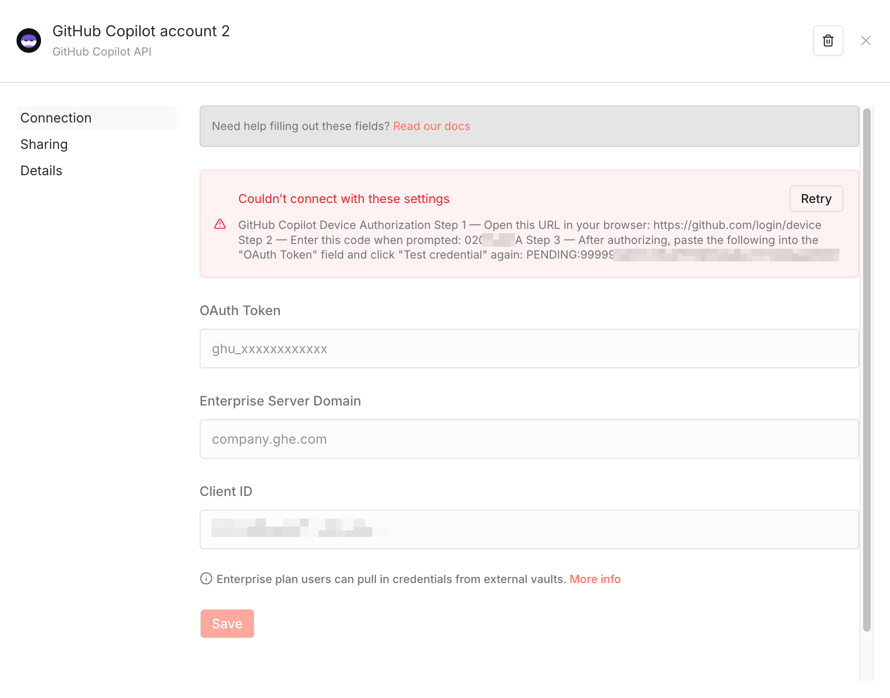

# Set up GitHub Copilot credentials in n8n

## Option 1: Use the credentials helper
Open the GitHub Copilot API credential page from either:
- In Credentials page: `Create Credential -> GitHub Copilot API`, or
- In Workflow page: `Add a GitHub Copilot Chat Model node -> Credential field -> Create new credential`

Steps:
1. Leave the OAuth Token field empty.
2. Click "Save". You should see a "Couldn’t connect with these settings" error. Click "More details".
3. The details include device authorization steps, for example:
   ```
   GitHub Copilot Device Authorization
   Step 1 — Open this URL in your browser: https://github.com/login/device
   Step 2 — Enter this code when prompted: XXXX-XXXX
   Step 3 — After authorizing, paste the following into the "OAuth Token" field and click "Save" again: PENDING:xxx
   ```
4. 
5. Follow the steps, paste the token, and click Save again.

## Option 2: Use the local script
Download and run [scripts/get-copilot-oauth-token.sh](scripts/get-copilot-oauth-token.sh) locally to get an OAuth token.
curl and run:
```bash
curl https://raw.githubusercontent.com/kk17/n8n-nodes-github-copilot-chat-models/refs/heads/main/scripts/get-copilot-oauth-token.sh | bash
```


## OAuth App
By default, the n8n credential helper and script use OpenCode's OAuth app to get the OAuth token. You can follow
[Creating an OAuth app](https://docs.github.com/en/apps/oauth-apps/building-oauth-apps/creating-an-oauth-app) to create your own app if you prefer.